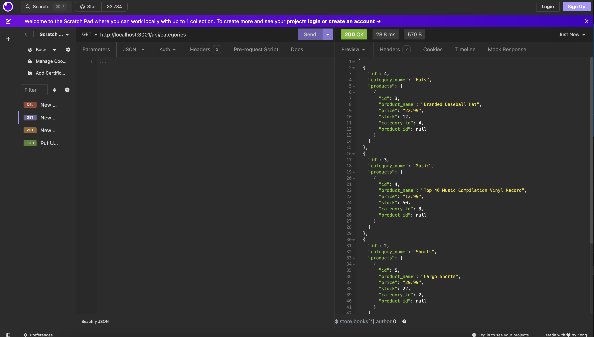

# E-commerce Back-end

## Description

This is a back-end application that demonstrates the routes for an ecommerce website. These routes include GET, POST, and DELETE for categories, products, and tags. Creating this application was very helpful in better understanding how routes work and what they do. The purpose of this demonstration is to help those understand how to get and target specific information via routes.

## Installation

Run the schema.sql, run the seeds, start the server. 

## Usage

## Credits

Starter code courtesy of Boot Camp.